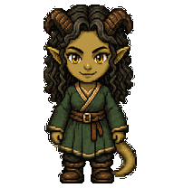
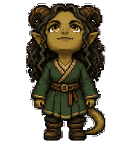

# Chibi Maeril



Chibi Maeril is a small pixel-art companion for the ChatGPT desktop app and
Codex CLI. Her green robes, curled horns, watchful eyes, and knowing smile bring
a little of Maeril's practical wit to your desktop.

## Read Maeril's story

**[Read *Mercy and Wards* free →](https://monkandwitch.com/en/b1/)**

A monk takes a blade meant for a frightened boy. A witch watching through her
hawk refuses to let his mercy end in a prison cell. *Mercy and Wards* is the
first novel in *The Monk & The Witch*.

## Install

1. Download the `chibi-maeril-desktop-<version>.zip` file from the
   [latest release](https://github.com/monk-witch/pet-maeril/releases/latest).
2. Extract the archive into your Codex pets directory. By default, that is
   `~/.codex/pets/`; if you set `CODEX_HOME`, use `$CODEX_HOME/pets/` instead.
3. Open **Settings → Pets**, select **Refresh**, and choose **Chibi Maeril**.
4. Enter `/pet` to wake her.

After extraction, the runtime files should be:

```text
~/.codex/pets/chibi-maeril/
├── pet.json
└── spritesheet.webp
```

See the [official OpenAI pet documentation](https://learn.chatgpt.com/docs/pets)
for interface availability and pet controls.

## Meet Maeril

Maeril Greenward is a curious, clever witch with protective instincts and little
patience for needless ceremony. Her care is practical; her humour often arrives
with a raised eyebrow. This pet uses her uninjured appearance, with two healthy
golden eyes and two intact horns.

Explore her Actual Play material:

- [Complete Maeril dossier](https://monkandwitch.com/en/play/maeril/)
- [Level 1](https://monkandwitch.com/en/play/maeril/level/1/)
- [Level 4](https://monkandwitch.com/en/play/maeril/level/4/)
- [Level 8](https://monkandwitch.com/en/play/maeril/level/8/)
- [Level 20](https://monkandwitch.com/en/play/maeril/level/20/)
- [Spellbook](https://monkandwitch.com/en/play/maeril/spellbook/)

## The pet



The simple pixel-art figure has no staff or other props. The transparent,
lossless WebP atlas contains nine standard animation states and sixteen
clockwise look directions. It is a desktop v2 atlas measuring 1536 × 2288
pixels, arranged as an 8 × 11 grid of 192 × 208 pixel cells.

The package is built for the ChatGPT desktop app and compatible Codex CLI
terminals. It is not the separate 1536 × 1872 format used for ChatGPT web pet
uploads.

## Companion pets

[Chibi Rishi](https://github.com/monk-witch/pet-rishi) brings the monk's quiet
resolve to the same pixel-art companion series.

## License and notices

Chibi Maeril is © 2026 Fred Potvin and is licensed under the
[Creative Commons Attribution-NonCommercial-ShareAlike 4.0 International
license](LICENSE). See [NOTICE.md](NOTICE.md) for attribution, fan-content, and
trademark notices.
